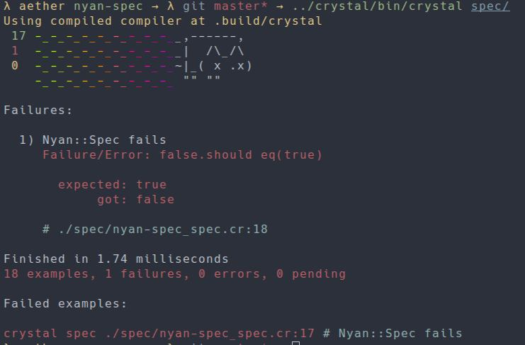

# nyan-spec

This is a port of the nyancat reporter from [mocha](https://github.com/mochajs/mocha).

## Example



## Installation

Add this to your application's `shard.yml`:

```yaml
dependencies:
  nyan-spec:
    github: kumpelblase2/nyan-spec
```


## Usage

Early in your specs, add this:

```crystal
require "nyan-spec"

# Somewhere early in your spec code
NyanSpec.init
```

## Contributing

1. Fork it ( https://github.com/kumpelblase2/nyan-spec/fork )
2. Create your feature branch (git checkout -b my-new-feature)
3. Commit your changes (git commit -am 'Add some feature')
4. Push to the branch (git push origin my-new-feature)
5. Create a new Pull Request
